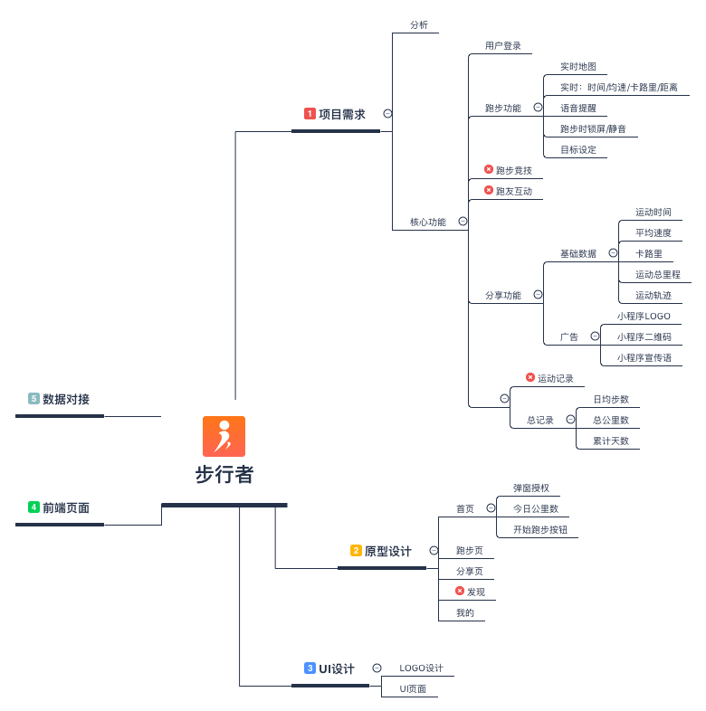
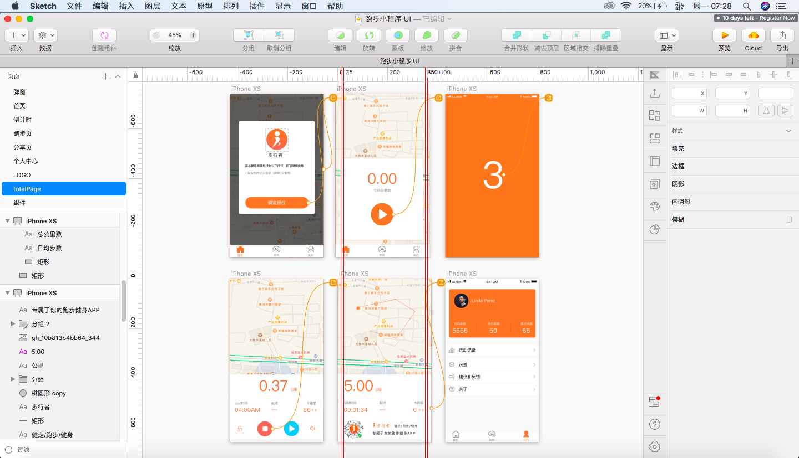

# buxingzhe-applet

## 前言

最近公司一直在做小程序这块的项目，想着也自己做一款小程序，可是做什么小程序比较好呢？其实在这之前我已经上线了一款利用V2EX API做的一个小DEOM，不过这个并没有什么实用价值，其实就是为了练手而诞生的试验品。

个人喜欢跑步，几乎是每日一跑，有时跑步就会用到“悦动”这样的跑步辅助APP，但是个人感觉体验不是很好，每次进去都弹出领红包（说实话，每天领这几分钱/几毛钱，手都不想点一下，直接关闭），于是乎就想着自己能不能也做一款跑步类的APP，先就从小程序版本开始。

我要做的这款跑步类APP一定要有自己的特色，之前我为这款APP起了几个名字：独步/步行者，但是总感觉没有什么新意，有一天，我跑步时想到一个“趣”字，就感觉很有特色，对于之后做的功能也有相当大的区间可扩展，可分为四大块：趣跑步/趣游戏/趣互动/趣数据。

## 思维导图

## UI图

